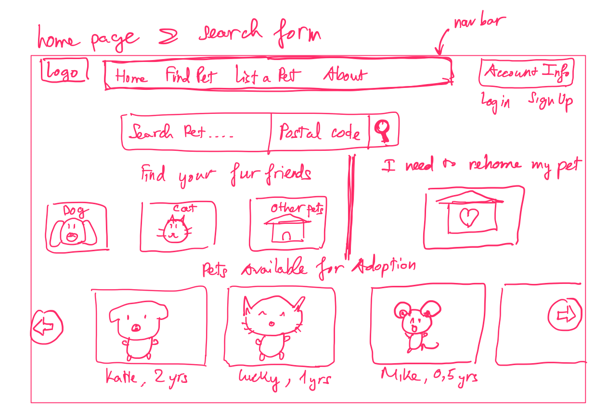
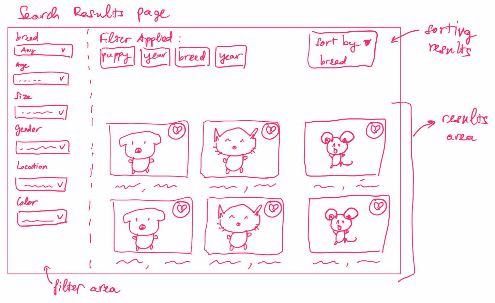
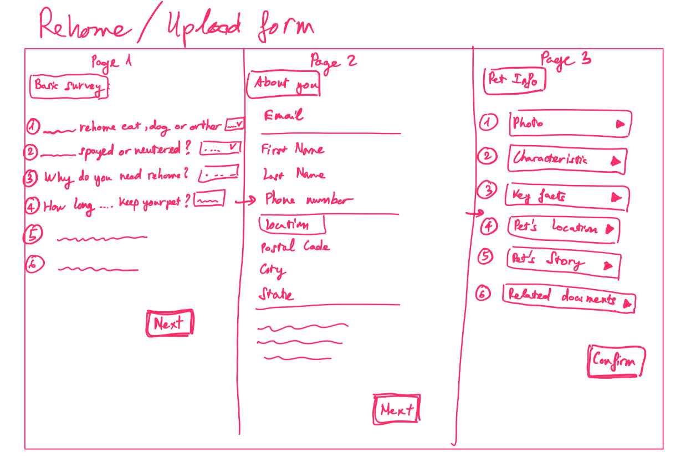

# CPSC455_2023S_HappyTail

# Project Description:
Happy Tails is a project focused on creating a pet adoption platform. The website aims to provide a user-friendly interface where users can upload information about pets available for adoption, including cats and dogs. The platform caters to pets that are abandoned, stray, abused, or simply in need of a new home. Happy Tails will store data such as pet profiles, including details such as breed, age, gender, and photos. Users will be able to browse through the available pets, view their profiles, and contact the organization or individual responsible for the pet's adoption.

# Project Requirements:

## Minimal Requirements
1. - [x] Each pet has its own information card, which includes: photo, name, breed, etc.

2. - [x]  Search panel: user can search for pets based on parameters like age, breed, size, etc.

3. - [x] Result page(on browse page): display all the pet cards with brief information based on customer search parameters, and users are able to click on a card to see details regarding any pets

4. - [x] Add new pet panel: include all information mentioned in minimum requirement 1, plus contact information. 

5. - [x] Pet card can only be edited/deleted by its owner.

## Standard
1. - [x] Sign up/log in/log out
   - User will be able to sign up an account
   - User with existing account will be able to log into his/her account, and safely log out
   
2. - [x] User will be able to edit his/her profile

3. - [x] 2 types of users: pet owner and pet adopter
   - Different users will see different dashboard after they log in
   
4. - [x] My listing (Dashboard)
   - User will be able to add new pets looking for adoption, update and deleter his/her existing lists
   - Users need to have an account and log in if they want to do the above operation.

5. - [x] My Favorite (Dashboard)
   - User will be able to add pets to his/her favorite list, and delete if they want
   - Users need to have an account and log in if they want to favorite/un-favorite a pet.

6. - [x] Share pet with friend: user will be able to share the link of a pet by clicking a share button.

## Stretch
1. - [x] Integrate website with external API: EmailJS, where user will be able to send email to pet owner once open the preview of pet information card.
   
2. - [ ] Recommendation algorithm to show users pets based on his/her search history

## Sketches

